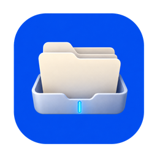
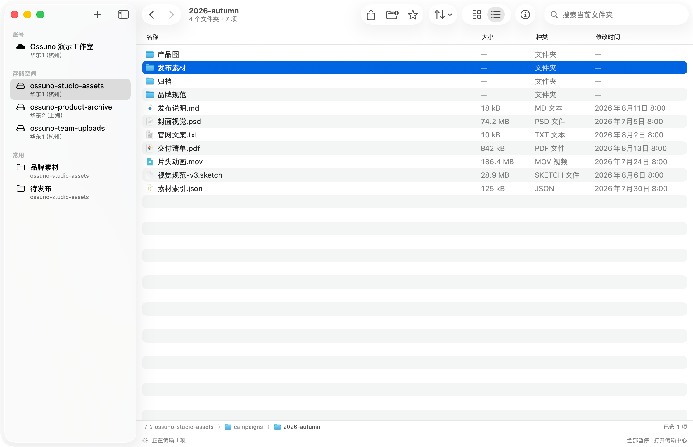
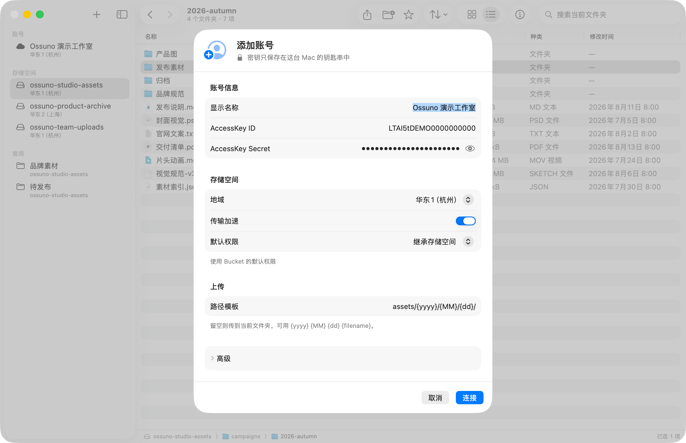

<p align="center">
  
</p>

<h1 align="center">Ossuno</h1>

<p align="center">
  <strong>像使用访达一样管理阿里云 OSS。</strong><br>
  原生 macOS 客户端，专注对象浏览、安全整理与可恢复传输。
</p>

<p align="center">
  <a href="https://github.com/ihopefulChina/Ossuno/actions/workflows/app.yml"></a>
  <a href="https://github.com/ihopefulChina/Ossuno/releases/latest"></a>
  <a href="https://www.npmjs.com/package/ossuno-mcp"></a>
  <a href="#系统要求"></a>
  <a href="LICENSE"></a>
</p>

<p align="center">
  <a href="https://ihopefulchina.github.io/Ossuno/"><strong>官网</strong></a>
  &nbsp;·&nbsp;
  <a href="#快速开始"><strong>快速开始</strong></a>
  &nbsp;·&nbsp;
  <a href="#让-ai-操作-oss"><strong>AI · MCP</strong></a>
  &nbsp;·&nbsp;
  <a href="https://ihopefulchina.github.io/Ossuno/support.html">使用支持</a>
  &nbsp;·&nbsp;
  <a href="https://github.com/ihopefulChina/Ossuno/releases">更新日志</a>
</p>

<p align="center">
  <picture>
    <source media="(prefers-color-scheme: dark)" srcset="website/assets/browser-dark-1.0.5.png">
    
  </picture>
</p>

Ossuno 把高频 OSS 操作放进一个符合 macOS 使用习惯的窗口：从账号、Bucket 和收藏位置进入，搜索与预览对象，拖放上传或导出到访达，并在内容区底部处理传输进度。它不是桌面版 OSS 控制台，而是一款边界清晰的日常文件工具。

## 核心能力

| 场景 | Ossuno 提供的能力 |
| --- | --- |
| 浏览与查找 | 网格 / 列表视图、路径导航、收藏位置、当前文件夹搜索、Bucket 分页搜索、类型 / 大小 / 日期筛选 |
| Mac 原生交互 | 拖放、Command / Shift 多选、Return 原地重命名、Space 快速查看、`⌘I` 对象信息、链接分享与完成通知 |
| 云端整理 | 新建文件夹、剪切 / 复制 / 粘贴、重命名、删除、跨 Bucket 复制或移动、冲突时跳过或保留两者 |
| 可靠传输 | multipart 上传、分段下载、持久化检查点、暂停 / 继续、失败重试、并发与方向限速、CRC64 校验 |
| 对象配置 | Content-Type、Cache-Control、Content-Disposition、用户元数据、OSS 标签、ACL 与临时签名链接 |
| AI 自动化 | 独立的 `ossuno-mcp` 服务器，提供 Bucket 浏览、上传、下载和临时链接工具 |

## 快速开始

### 系统要求

- Apple Silicon 或 Intel Mac
- macOS 15 或更高版本

### 安装

1. 打开 [Ossuno 1.0.5 Release](https://github.com/ihopefulChina/Ossuno/releases/tag/v1.0.5)，下载与芯片匹配的安装包：[Apple Silicon（M 系列）](https://github.com/ihopefulChina/Ossuno/releases/download/v1.0.5/Ossuno-1.0.5-arm64.dmg) · [Intel（x86_64）](https://github.com/ihopefulChina/Ossuno/releases/download/v1.0.5/Ossuno-1.0.5-x86_64.dmg)。不确定架构时，在苹果菜单的「关于本机」中查看“芯片”或“处理器”。
2. 打开 DMG，将 Ossuno 拖入「应用程序」。
3. 启动 Ossuno，添加一个权限最小化的 RAM 子账号，选择地域并打开 Bucket。

> [!IMPORTANT]
> **从 1.0.4 或更早版本升级到 1.0.5 必须手动下载。** 1.0.5 将 Bundle ID 从 `studio.ossuno.oss` 更正为 `app.ihopeful.Ossuno`，Sparkle 只会为旧身份显示升级说明，不会直接替换应用。退出旧版后，下载对应芯片的 1.0.5 DMG 并将 Ossuno 拖入「应用程序」。1.0.5 会迁移旧偏好与账号显示配置，并继续查找原钥匙串凭证；macOS 可能会要求你允许新应用身份访问钥匙串，也可能再次请求通知权限。

> [!WARNING]
> 当前两个 DMG 均采用 **ad-hoc** 代码签名，不是 Developer ID 签名，且未经 Apple 公证。首次启动通常会被 Gatekeeper 拦截。请先确认安装包来自本仓库的 GitHub Releases，再前往「系统设置 → 隐私与安全」，在“安全性”区域选择「仍要打开」。详情见 [Apple 的安全打开说明](https://support.apple.com/zh-cn/102445)。

### 首次连接

填写 AccessKey ID、AccessKey Secret，并按需填写 STS Token、自定义 Endpoint、CDN 域名、传输加速与上传路径模板。Secret 与 Token 存入 macOS 钥匙串，账号显示设置与凭证分开保存。

<p align="center">
  <picture>
    <source media="(prefers-color-scheme: dark)" srcset="website/assets/account-dark-1.0.5.png">
    
  </picture>
</p>

建议先用仅能访问目标 Bucket 的 RAM 子账号连接。Ossuno 不创建 Bucket，也不代替阿里云控制台管理 RAM、生命周期、CORS、跨区域复制策略或未完成分片。

## 像访达一样工作

### 查找、预览与分享

- 默认搜索当前文件夹；切换到「当前 Bucket」后会分页扫描并显示进度。
- 空格打开快速查看，`⌘I` 查看对象属性；常用前缀可收藏到侧边栏。
- 可复制直链、Markdown 或 HTML，也可为私有对象生成有时效的签名链接。
- 单次聚合最多读取 30 页，通常约 3 万个对象；达到边界后会标记结果不完整，并阻止可能遗漏对象的文件夹级危险操作。

### 整理与跨 Bucket 传输

- Bucket 内支持重命名、拖放、复制、移动与删除；目标冲突时可以询问、跳过或保留两者。
- 同账号、同地域的跨 Bucket 操作走 OSS 云端复制；跨账号或跨地域时会先提示，再通过当前 Mac 中转。
- 将对象或文件夹拖到访达即可下载；多选会保留云端目录结构，本地已有同名文件时不会静默覆盖。

### 暂停后继续

大文件上传会保存 multipart upload ID 与已完成分片，下载会按固定字节范围写入临时文件。暂停、退出或短暂断网后，可以从检查点继续；完成后在 OSS 提供校验值时核对 CRC64，再原子发布本地文件。

传输中心支持上传 / 下载独立并发数、暂停与继续、失败重试、队列置顶、速度与剩余时间、方向限速以及完成通知。传输进行时也可在菜单栏查看状态。

## 权限与安全边界

Ossuno 对可能覆盖或删除数据的操作采用“无法证明安全就取消”的策略：

- AccessKey Secret 与 STS Token 只保存在 macOS 钥匙串；诊断摘要不会包含账号名、AccessKey ID、Bucket、对象键、本地路径、URL、请求 ID、Secret 或 Token。
- 默认继承 Bucket ACL。切换为公共权限前会说明影响并再次确认。
- 路径穿越、符号链接逃逸、不完整分页和未解决的目标冲突会中止对应批量操作。
- 覆盖要求目标 Bucket 已开启版本控制并返回精确 `versionId`；否则只能跳过、保留两者或取消。
- 移动会先完成全部复制，再按精确版本删除来源。无法同时确认来源与目标版本时不会自动删源。
- 保存 Content-Type、缓存策略、用户元数据或标签前会核对对象快照，并要求 Bucket 已开启版本控制。
- Bucket 开启版本控制时，刚删除的对象可撤销；未开启版本控制时，云端删除不可恢复。
- 应用内更新使用 Sparkle Ed25519 校验包完整性。该校验不等同于 Developer ID 身份验证或 Apple 公证。

### RAM 权限提示

请从列举、读取、上传、复制与删除对象所需的最小权限开始，并按使用场景补充：

| RAM Action | 使用场景 |
| --- | --- |
| `oss:GetBucketVersioning` | 在禁止覆盖、替换、删除或移动前确认版本控制状态 |
| `oss:GetObjectAcl` | 复制或移动时读取并保留对象 ACL |
| `oss:GetObjectVersion` | 在版本控制 Bucket 中复制、恢复或中转指定版本 |
| `oss:DeleteObjectVersion` | 撤销删除、清理精确版本或回滚已提交版本 |
| `oss:GetObjectTagging` / `oss:PutObjectTagging` | 复制时读取并保留对象标签 |

对象使用 SSE-KMS 时，还需对应密钥的 `kms:Decrypt` 与 `kms:GenerateDataKey` 权限。缺少安全检查所需的读取权限时，Ossuno 会取消相关操作，不会静默降级。

完整边界见 [Security Policy](SECURITY.md) 与 [隐私说明](https://ihopefulchina.github.io/Ossuno/privacy.html)。

## 让 AI 操作 OSS

[`ossuno-mcp`](https://www.npmjs.com/package/ossuno-mcp) 是本仓库发布的独立 MCP 服务器，可接入支持本地标准输入输出（stdio）传输的 MCP 客户端。需要 macOS 和 Node.js 18 或更高版本。

```bash
npx ossuno-mcp auth       # 创建或更新凭证档案，并保存到 macOS 钥匙串
npx ossuno-mcp auth --test
npx ossuno-mcp install    # 自动检测并注册本机已安装的 MCP 客户端
```

重启客户端后，可以直接提出任务：

> 列出 `design-assets` Bucket 的 `launch/` 目录，把桌面的 `hero.png` 上传到 `launch/2026/`，再生成一个 24 小时有效的临时链接。

服务器暴露 5 个工具：`list_buckets`、`list_objects`、`upload_file`、`download_file` 与 `presign_url`，另带 OSS 专家和批量上传两个提示词。

MCP 的凭证与桌面 App 账号相互独立；默认仅允许访问桌面、文稿、下载与系统临时目录，并拒绝符号链接逃逸。上传默认拒绝覆盖，只有用户明确确认后才应使用 `overwrite=true`。它不提供删除对象、创建 Bucket 或修改权限策略的工具。

客户端配置、多账号档案、允许目录与故障排查请查看 [MCP 使用指南](docs/mcp.md)。

## 常用快捷键

| 操作 | 快捷键 |
| --- | --- |
| 添加账号 | `⇧⌘A` |
| 剪切 / 复制 / 粘贴 | `⌘X` / `⌘C` / `⌘V` |
| 上传 / 从剪贴板上传 | `⌘O` / `⇧⌘V` |
| 新建文件夹 | `⇧⌘N` |
| 打开传输中心 | `⌥⌘L` |
| 网格 / 列表视图 | `⌘1` / `⌘2` |
| 后退 / 前进 | `⌘[` / `⌘]` |
| 快速查看 / 对象信息 | `Space` / `⌘I` |
| 重命名 / 撤销 | `Return` / `⌘Z` |

## 开发与验证

项目使用 Swift 6、SwiftUI、AppKit、Swift Testing 与锁定版本的 Sparkle。克隆仓库并使用 Xcode 打开：

```bash
git clone https://github.com/ihopefulChina/Ossuno.git
cd Ossuno
open Ossuno.xcodeproj
```

命令行构建：

```bash
xcodebuild \
  -project Ossuno.xcodeproj \
  -scheme Ossuno \
  -destination 'generic/platform=macOS' \
  -configuration Debug \
  -onlyUsePackageVersionsFromResolvedFile \
  -skipPackageUpdates \
  build
```

提交 Pull Request 前运行最窄相关测试；完整的本地检查入口为：

```bash
REAL_OSS_SMOKE=0 xcodebuild \
  -project Ossuno.xcodeproj \
  -scheme Ossuno \
  -destination 'platform=macOS,arch=arm64' \
  -onlyUsePackageVersionsFromResolvedFile \
  -skipPackageUpdates \
  test

(cd Tools/ossuno-mcp && swift test --disable-sandbox -Xswiftc -warnings-as-errors)
scripts/validate-website.sh
```

公开测试不会读取真实 OSS 凭证；只有显式设置 `REAL_OSS_SMOKE=1` 才会执行真实 OSS 冒烟测试。贡献约定与完整检查清单见 [CONTRIBUTING.md](CONTRIBUTING.md)。

## 文档与支持

| 文档 | 内容 |
| --- | --- |
| [产品官网](https://ihopefulchina.github.io/Ossuno/) | 产品概览、下载与功能介绍 |
| [MCP 使用指南](docs/mcp.md) | 安装、客户端配置、权限边界与故障排查 |
| [支持中心](https://ihopefulchina.github.io/Ossuno/support.html) | 首次打开、账号、传输、恢复与更新 |
| [版本记录](https://github.com/ihopefulChina/Ossuno/releases) | 发布说明与双架构安装包 |
| [Security Policy](SECURITY.md) | 安全边界与私密漏洞报告入口 |

一般问题与功能建议请提交 [GitHub Issue](https://github.com/ihopefulChina/Ossuno/issues/new/choose)。提交截图或诊断信息前，请使用虚拟数据或遮盖账号、Bucket、对象名、路径与 URL；安全漏洞请使用 [Private vulnerability reporting](https://github.com/ihopefulChina/Ossuno/security/advisories/new)。

## License

Ossuno 采用 [MIT License](LICENSE) 开源，并非阿里云官方产品。
