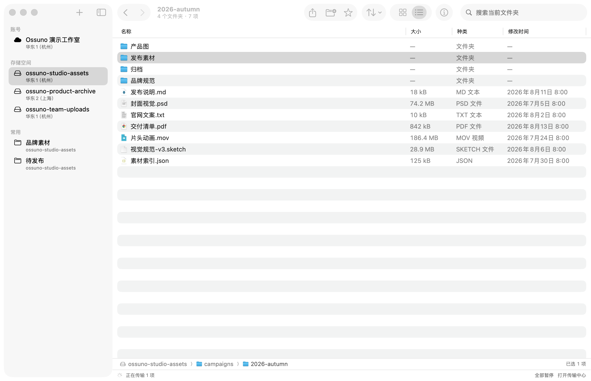
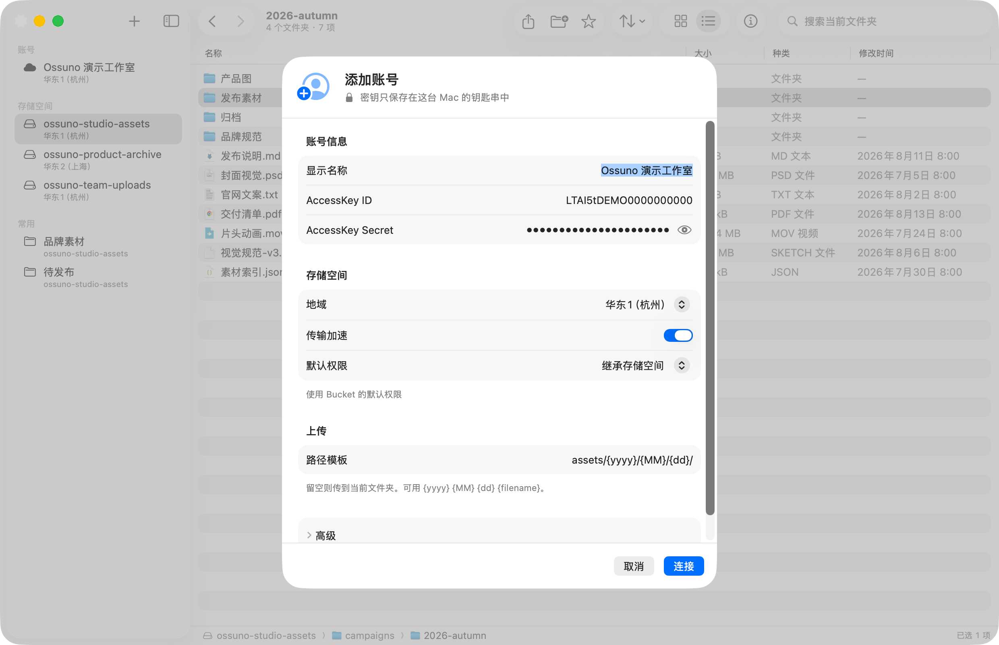

<p align="center">
  
</p>

<h1 align="center">Ossuno</h1>

<p align="center">
  在 Mac 上，像用访达一样用阿里云 OSS。
</p>

<p align="center">
  <a href="https://ihopefulchina.github.io/Ossuno/"><strong>官网</strong></a>
  &nbsp;·&nbsp;
  <a href="https://github.com/ihopefulChina/Ossuno/releases/latest/download/Ossuno-1.0.3-arm64.dmg"><strong>下载 Apple Silicon 版</strong></a>
  &nbsp;·&nbsp;
  <a href="https://github.com/ihopefulChina/Ossuno/releases/latest/download/Ossuno-1.0.3-x86_64.dmg"><strong>下载 Intel 版</strong></a>
  &nbsp;·&nbsp;
  <a href="https://www.npmjs.com/package/ossuno-mcp"><strong>使用 ossuno-mcp</strong></a>
  &nbsp;·&nbsp;
  <a href="https://ihopefulchina.github.io/Ossuno/support.html">使用支持</a>
  &nbsp;·&nbsp;
  <a href="https://github.com/ihopefulChina/Ossuno/releases">版本记录</a>
</p>

<p align="center">Apple Silicon 或 Intel · macOS 15 或更高版本</p>

<p align="center">
  
</p>

Ossuno 是一个原生的 macOS OSS 客户端。它不打算把控制台搬进桌面，只做日常最常用的事：查找、预览、整理、传输和恢复，都在一个安静、熟悉的 Mac 窗口里完成。

## 让 AI 直接操作 OSS（ossuno-mcp）

[`ossuno-mcp`](https://www.npmjs.com/package/ossuno-mcp) 已发布到 npm。它是一个可独立使用的 MCP 服务器：配置到 Codex、Claude Desktop、Claude Code、Cursor 等支持 MCP 的 AI 客户端后，AI 就能用自然语言浏览 Bucket、上传下载文件、生成临时下载链接。

```bash
npx ossuno-mcp auth     # 配置 OSS 凭证，只保存到 macOS 钥匙串
npx ossuno-mcp install  # 一键注册到本机已安装的 AI 客户端
```

需要 macOS 与 Node.js 18 或更高版本。npm 包会按 Mac 架构安装 arm64 或 x64 预编译二进制。服务器提供 5 个工具和 2 个提示词（OSS 专家模式、批量上传工作流），凭证与 Ossuno App 账号相互独立。

> 把桌面上的 hero.png 上传到 ossuno-assets 的 assets/2026/ 目录，再给我一个 24 小时有效的链接。

完整命令、客户端配置与安全边界见 [MCP 使用指南](docs/mcp.md)和[官网 AI · MCP 页面](https://ihopefulchina.github.io/Ossuno/mcp.html)。

## 从找到文件开始

当前文件夹的搜索即时出结果；切到「当前 Bucket」后，Ossuno 会分页扫描整个 Bucket 并显示进度。结果可以按类型、大小和修改日期筛选，双击回到所在文件夹，空格快速查看。

常用的 OSS 文件夹可以收藏到侧边栏。

## 像访达一样整理

- 单击选中，Command 多选，Shift 连选，Return 原地重命名。
- 网格与列表、路径栏、方向键、空格快速查看和 `⌘I` 信息窗口，都是熟悉的 Mac 操作。
- 在 Bucket 内拖放、复制或移动文件夹；目标冲突可以询问、跳过或「保留两者」，已开启版本控制时还可安全替换。
- 把对象或整个文件夹直接拖到访达。多选时会生成一个「Ossuno 下载」文件夹，保留云端目录结构。
- 复制后切换 Bucket 再粘贴，就能跨 Bucket 整理。同账号同地域走云端复制；其他情况会先说明清楚，再经由这台 Mac 中转。

覆盖只在目标 Bucket 已开启版本控制、OSS 返回精确 `versionId` 时执行；未开启时可选择「保留两者」或跳过。移动永远先完成全部复制，再按精确 `versionId` 删除来源；只有来源和目标 Bucket 都开启版本控制、且能确认两个精确版本时才会自动删源。未开启、已暂停或无法读取版本状态时会安全取消移动，你仍可先复制并在 OSS 控制台核对后手动删除来源。

## 传输可以停下来，再继续

大文件上传会持久保存 multipart upload ID 和已完成的分片；下载按固定字节范围写入隐藏临时文件。暂停、退出或短暂断网后，可以从最近的检查点继续。完成时会在 OSS 提供校验值的情况下核对 CRC64，再原子发布下载文件。

传输中心提供上传/下载独立并发数、暂停与继续、失败重试、队列置顶、速度、剩余时间、方向限速和完成通知。下载从不静默覆盖本地同名文件。

## 对象属性

「对象属性」可以编辑 Content-Type、Cache-Control、Content-Disposition、用户元数据和最多十个 OSS 标签。重复键、空键和换行注入会在提交前被拦下；只改标签时不会重写元数据。为避免并发改写无法恢复，保存对象属性需要 Bucket 已开启版本控制。Bucket 开了版本控制的话，刚删除的项目也可以立即撤销。

## 安全边界

- AccessKey Secret 与 STS Token 保存在 macOS 钥匙串。
- 新账号默认继承 Bucket 权限；要改成公共权限前会先解释影响并再次确认。
- 账号配置原子写入，并保留上一份可恢复副本。
- 路径穿越、符号链接逃逸、不完整分页和目标冲突都会中止相关批量操作。
- 诊断摘要不包含账号名、AccessKey ID、Bucket、对象键、本地路径、URL、请求 ID、Secret 或 Token。
- 软件内更新会执行 Sparkle Ed25519 完整性校验；它用于确认更新包与发布源一致，不代表 Developer ID 签名或 Apple 公证。安装完成后会自动退出并重新打开 Ossuno。

## 安装

1. 按这台 Mac 的芯片下载 Ossuno：[Apple Silicon（M 系列）](https://github.com/ihopefulChina/Ossuno/releases/latest/download/Ossuno-1.0.3-arm64.dmg)或 [Intel](https://github.com/ihopefulChina/Ossuno/releases/latest/download/Ossuno-1.0.3-x86_64.dmg)。不确定时，可在苹果菜单的「关于本机」中查看芯片或处理器。
2. 打开 DMG，把 Ossuno 拖进「应用程序」。
3. 双击 Ossuno 尝试打开一次。若 macOS 阻止运行，打开「系统设置 → 隐私与安全」，滚动到“安全性”，点击「仍要打开」，在再次出现的警告中点击「打开」（系统可能要求密码或 Touch ID）。
4. 添加权限最小化的 RAM 子账号，选择地域，然后打开 Bucket。

> **分发说明：** 两个 DMG 均采用 ad-hoc 代码签名（没有开发者身份），不是 Developer ID 签名，且未经 Apple 公证。因此 macOS 无法验证开发者或确认安装包已经过 Apple 恶意软件检查，首次打开通常会触发 Gatekeeper。仅在确认安装包来自本仓库的 GitHub Releases 时按上述步骤放行。参见 [Apple 的安全打开说明](https://support.apple.com/zh-cn/102445)。

装好带自动更新功能的版本后，可以在「Ossuno → 检查更新…」直接升级，也可以在设置里开启自动检查。

### RAM 权限提示

Ossuno 在复制、移动、覆盖和撤销前会读取 Bucket 版本控制状态与对象 ACL，并在版本控制 Bucket 中按具体版本执行复制或清理。已有的自定义 RAM 策略除了列举、读取、上传、复制和删除对象等基础动作，还需要按使用场景加入：

- `oss:GetBucketVersioning`：确认 Bucket 是否能安全执行禁止覆盖、替换或删除；查询失败时 Ossuno 会安全取消相关操作。
- `oss:GetObjectAcl`：复制或移动时读取并保留对象 ACL。RAM 动作名以 `Acl` 结尾，不是 API 名 `GetObjectACL` 的全大写写法。
- `oss:GetObjectVersion`：版本控制 Bucket 中复制、恢复或中转指定版本时读取源版本。
- `oss:DeleteObjectVersion`：撤销删除、清理精确版本或回滚已提交版本时使用。
- `oss:GetObjectTagging` 与 `oss:PutObjectTagging`：复制时保留对象标签。

若对象使用 SSE-KMS，还需要对应 KMS 密钥的 `kms:Decrypt` 与 `kms:GenerateDataKey` 权限。缺少安全检查所需的读取权限时，Ossuno 不会静默降级为可能覆盖或误删数据的操作。

<p align="center">
  
</p>

账号支持 STS Token、传输加速、自定义 Endpoint、CDN 域名和上传路径模板。模板支持 `{yyyy}`、`{MM}`、`{dd}`、`{HH}`、`{mm}`、`{ss}`、`{name}`、`{ext}` 与 `{filename}`。

## 常用快捷键

| 操作 | 快捷键 |
| --- | --- |
| 添加账号 | `⇧⌘A` |
| 剪切 / 复制 / 粘贴 | `⌘X` / `⌘C` / `⌘V` |
| 上传 / 从剪贴板上传 | `⌘O` / `⇧⌘V` |
| 新建文件夹 | `⇧⌘N` |
| 打开传输中心 | `⌥⌘L` |
| 网格 / 列表 | `⌘1` / `⌘2` |
| 后退 / 前进 | `⌘[` / `⌘]` |
| 快速查看 / 显示信息 | `Space` / `⌘I` |
| 重命名 / 撤销 | `Return` / `⌘Z` |

## 范围

Ossuno 专注对象浏览和传输，不创建 Bucket，也不管理 RAM、生命周期、CORS、跨区域复制策略或未完成分片等控制台资源。OSS 的「文件夹」是对象前缀；空文件夹通过占位对象表示。

单次聚合最多读取 30 页，通常约 3 万个对象。到边界时界面会明确标记结果不完整，并阻止可能遗漏对象的文件夹级危险操作。删除能不能恢复，取决于 Bucket 有没有开启版本控制。

## 从源码运行

```bash
git clone git@github.com:ihopefulChina/Ossuno.git
cd Ossuno
open Ossuno.xcodeproj
```

也可以用命令行：

```bash
xcodebuild -project Ossuno.xcodeproj \
  -scheme Ossuno \
  -destination 'generic/platform=macOS' \
  -configuration Debug build
```

项目使用 Swift 6、SwiftUI、AppKit、Swift Testing 和固定版本的 Sparkle，没有其他运行时依赖。

## 参与与支持

问题和建议请提交到 [GitHub Issues](https://github.com/ihopefulChina/Ossuno/issues/new/choose)。提交前可以从「帮助 → 复制诊断信息」拿到脱敏摘要；截图请使用虚拟数据或遮盖标识。安全问题请走 [Security Policy](SECURITY.md) 里的私密入口。

更多说明见 [Ossuno 官网](https://ihopefulchina.github.io/Ossuno/)、[支持页面](https://ihopefulchina.github.io/Ossuno/support.html) 和 [隐私说明](https://ihopefulchina.github.io/Ossuno/privacy.html)。

## License

Ossuno 采用 [MIT License](LICENSE) 开源。
